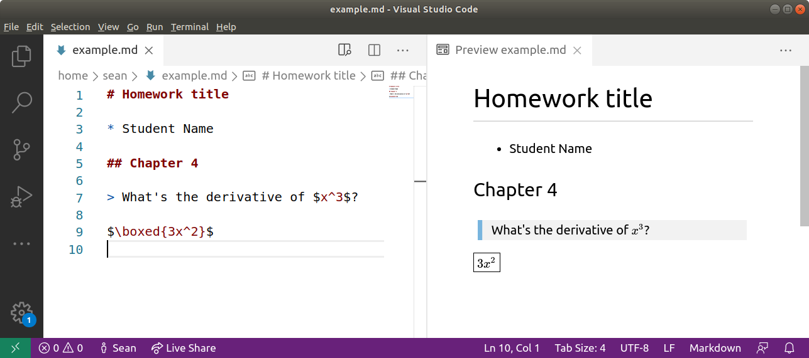

# Homework formatting

This is a description of how you may do technical (math, science) homework in VS Code in a way that looks good.

## Required software

* [Microsoft Visual Studio Code (VSCode)](https://code.visualstudio.com/)
* [Markdown+Math extension for VSCode](https://marketplace.visualstudio.com/items?itemName=goessner.mdmath)

## Languages used

* Markdown
  * [Cheat sheet](https://commonmark.org/help/)
* TeX
  * [Cheat sheet](https://www.math.brown.edu/~jhs/ReferenceCards/TeXRefCard.v1.5.pdf)

## Process

1. Open VSCode
2. Open the **Command Palette** by clicking **View** > **Command Palette**. We don't need to run anything now, but it's useful to remember how to open it.
3. Create a new file with the extension `.md` or `.markdown`
4. (optional) Enable Markdown+Math to auto-save
   * **File** > **Preferences** > **Settings**
   * Search for `Mdmath`
   * Tick the checkbox for **Mdmath: Autosave**
5. Click `Open Preview to the Side`
   * This icon can be found near the top-right of VSCode
   * You can also do this from the **Command Palette** by typing `> Markdown: Open Preview to the Side`
6. In your `.md` file (not the preview pane), write a document in Markdown. You can write TeX inline by surrounding it within `$` symbols, or on multiple lines within `$$` symbols. See [examples](examples/). Here's a very quick example:

	```
	# Homework title

	* Student Name

	## Chapter 4

	> What's the derivative of $x^3$?

	$\boxed{3x^2}$
	```
   

7. If you didn't choose to auto-save in step 4, you may save from the **Command Pallette** by typing `Markdown: Save Markdown+Math to HTML`. You can then open that file in your web browser. By default, it saves to the same directory as your markdown file.
8. If you want to save as `.pdf`, you can choose to print or export the page to `.pdf` format from your web browser.
